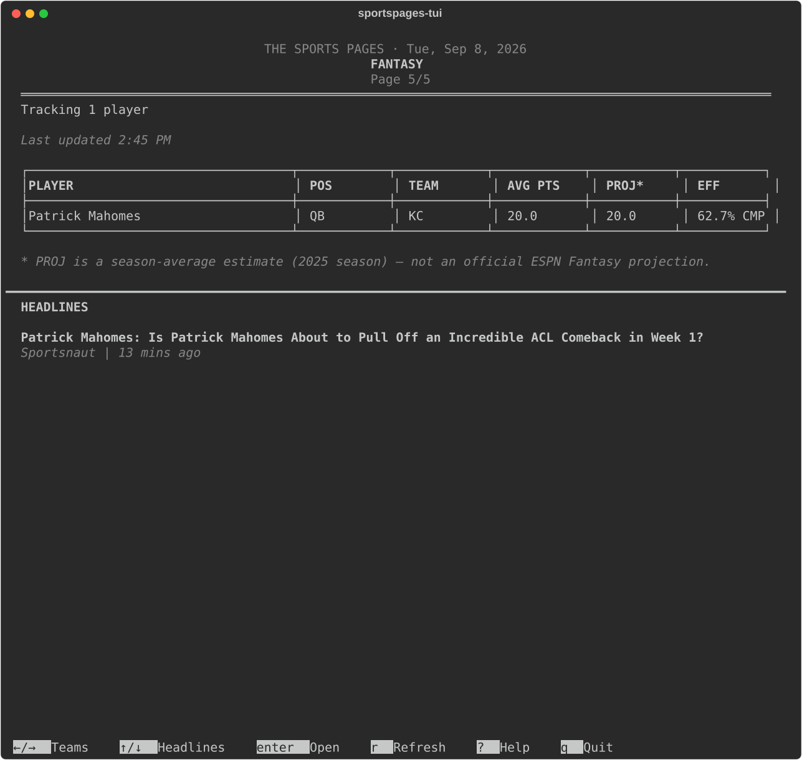

# sportspages-tui

A newspaper-styled terminal UI for following MLB, NCAAF, NFL, and NBA
games — plus a lightweight fantasy-football player tracker — in the
tradition of tools like Newsboat: launch it, swipe left/right between
your teams, scroll up/down through the news, single-letter hotkeys for
everything else.

Built with [Textual](https://textual.textualize.io/), pulling live data
from the free, keyless MLB Stats API (`statsapi.mlb.com`) and ESPN's
public site/news/search/odds feeds — no API key required, no account,
nothing to sign up for.

<p align="center">
  
</p>
<p align="center">
  
</p>
<p align="center">
  
</p>

## Status

MLB, NCAAF, NFL, and NBA are all supported. MLB has its own box-score
shape (innings, batting order, season player stats); the other three
share one "period sport" shape (quarters, standings, per-game leaders)
since their ESPN feeds are structurally identical.

There's also a Fantasy page: search and track individual NFL players
(via the pinned "FANTASY" entry at the top of the team picker) and see
them all on one aggregate page — season averages, a naive next-game
point estimate, and a headline per player. This is **not** tied to a
real ESPN Fantasy league (that API
needs a league id and, for private leagues, browser auth cookies we
don't have) — "PROJ" is our own season-average estimate, not ESPN's own
projection engine, and scoring is a standard non-PPR formula computed
from public season stats rather than your actual league's settings.

## Install

**Homebrew** (macOS/Linux):

```bash
brew install tylersuits1/sportspages-tui/sportspages-tui
```

**From source:**

```bash
python3 -m venv .venv
source .venv/bin/activate
pip install -e .
```

## Run

```bash
sportspages
# or: python -m sportspages_tui
```

On first launch (no followed teams yet) it opens the team picker
directly. Your followed teams persist between runs in
`~/.config/sportspages-tui/favorites.json`.

## Keys

| Key     | Action                                          |
|---------|--------------------------------------------------|
| ← / →   | Switch between followed teams                    |
| ↑ / ↓   | Scroll headlines / page content                  |
| `s`     | Toggle player stats (MLB) / standings (others)   |
| `b`     | Toggle batting order (MLB only)                  |
| `l`     | Toggle game leaders (NCAAF/NFL/NBA only)         |
| `r`     | Refresh now                                      |
| `a`     | Follow / unfollow teams                          |
| `p`     | Pause / resume live auto-refresh                 |
| `d`     | Toggle dark / light theme                        |
| `?`     | Help screen                                      |
| `q`     | Quit                                             |

Live scores auto-refresh every 20 seconds while a game is in progress,
and stop once the game goes final.

In the team picker (`a`): one scrollable list covers every sport —
MLB, then NCAAF, then NFL, then NBA, each broken into
league/conference → division → team, plus a pinned "FANTASY" entry at
the top that opens a dedicated NFL player search screen (back button
or `escape` returns to the team list). Typing in the search box matches
team name/city across all four sports at once. Division groups start
collapsed; `enter` expands one, follows/unfollows a team, or opens
Fantasy. `escape` on the team list asks you to confirm (y/n) before
exiting, listing everything you're following.

## Project layout

```
sportspages_tui/
├── app.py                  # Textual App — main screen, key bindings, live refresh
├── rendering.py            # pure functions building the Rich renderables (masthead, box score, etc.)
├── mlb_api.py              # MLB Stats API + ESPN news/odds client (async)
├── mlb_teams.py            # static MLB team/league/division table
├── models.py               # MLB dataclasses (BoxScore, TeamSide, PlayerStat, Headline, ...)
├── espn_period_sport.py    # shared ESPN "site API" parsing for NCAAF/NFL/NBA
├── period_models.py        # shared dataclasses for those three (PeriodBoxScore, StandingEntry, ...)
├── ncaaf_api.py / ncaaf_teams.py   # NCAAF-specific bits: AP rankings, conferences
├── nfl_api.py   / nfl_teams.py     # NFL-specific bits: conferences/divisions
├── nba_api.py   / nba_teams.py     # NBA-specific bits: conferences/divisions, PTS/REB/AST leaders
├── fantasy_api.py          # ESPN player search + per-player season stats -> our own fantasy scoring
├── config.py               # favorites + fantasy-player persistence (~/.config/sportspages-tui/)
├── date_format.py          # short (body) vs full (masthead) date formatting
├── screens/
│   ├── team_picker.py      # one MLB/NCAAF/NFL/NBA team tree, with cross-sport search
│   ├── fantasy_picker.py   # separate NFL player search screen, reached from the picker
│   └── help.py             # keybinding reference overlay
└── app.tcss                 # styling
```

## Testing

No live game finishing during development makes the "up next" /
completed-game path hard to eyeball manually, so there's a headless
smoke test that drives the real app (via Textual's test pilot) against
live data and asserts on state — team switching, panel toggles, live
data actually arriving:

```bash
python tests/smoke_test.py
python tests/fantasy_smoke_test.py   # search/follow/render for a real NFL player
```

`tests/screenshot_test.py` dumps an SVG render of the live app to
`tests/screenshot.svg` for visual spot-checks (gitignored, not meant to
be committed).

## A note on data sources

MLB data comes from the MLB Stats API; NCAAF/NFL/NBA scores, standings,
rankings, odds, and news all come from ESPN's public `site.api.espn.com`
endpoints — the same ones espn.com's own website calls, not a
documented, licensed public API. Disney's (ESPN's parent company)
Terms of Use prohibit automated/robotic access and scraping of their
products, so pulling this data programmatically is against ESPN's
terms as written, even though it's a small, personal, non-commercial
tool and this style of hobby project is common. This is not legal
advice — if that risk matters for your use case, evaluate it yourself
before relying on this.

## License

[MIT](LICENSE)
