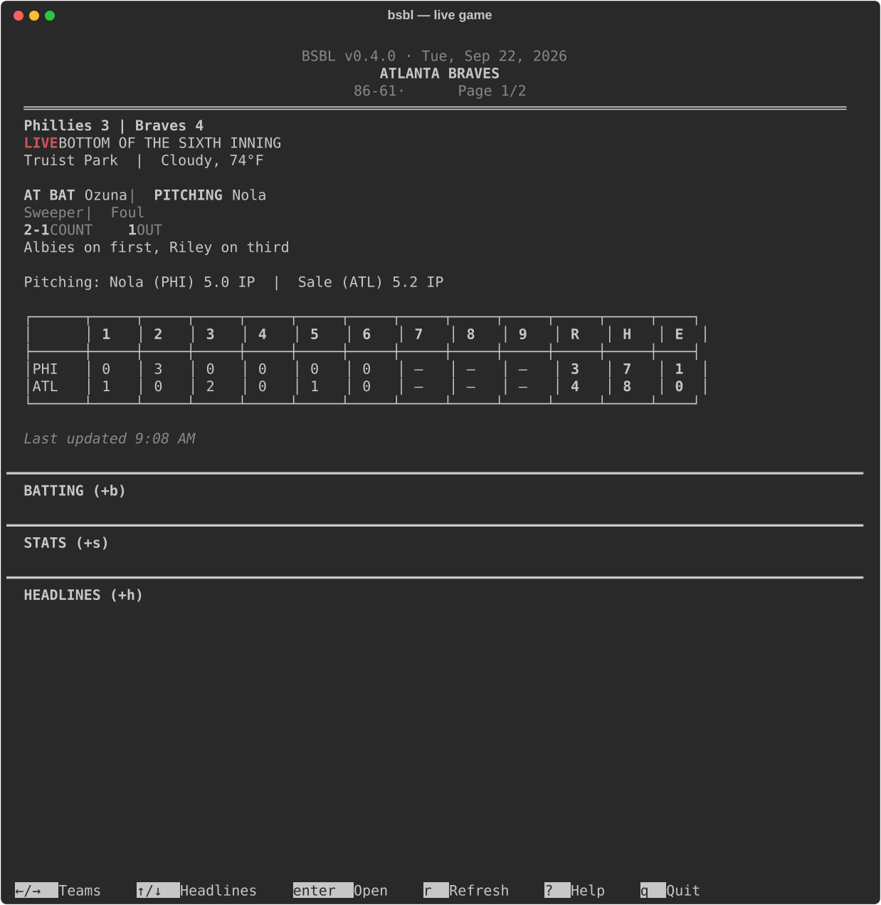
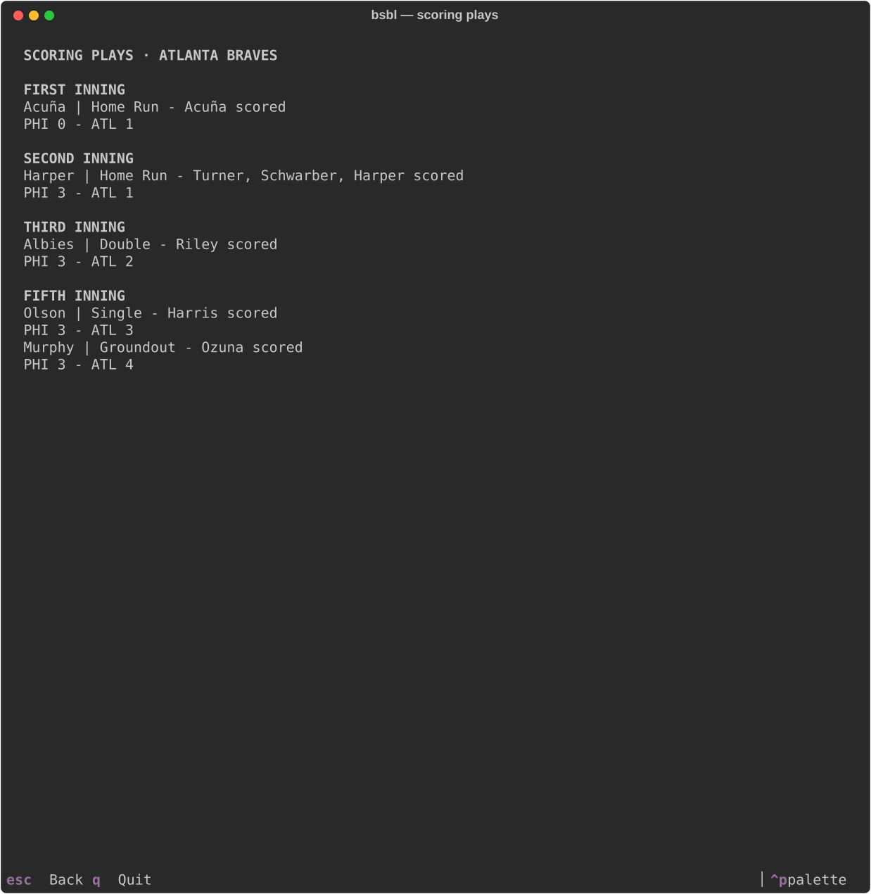
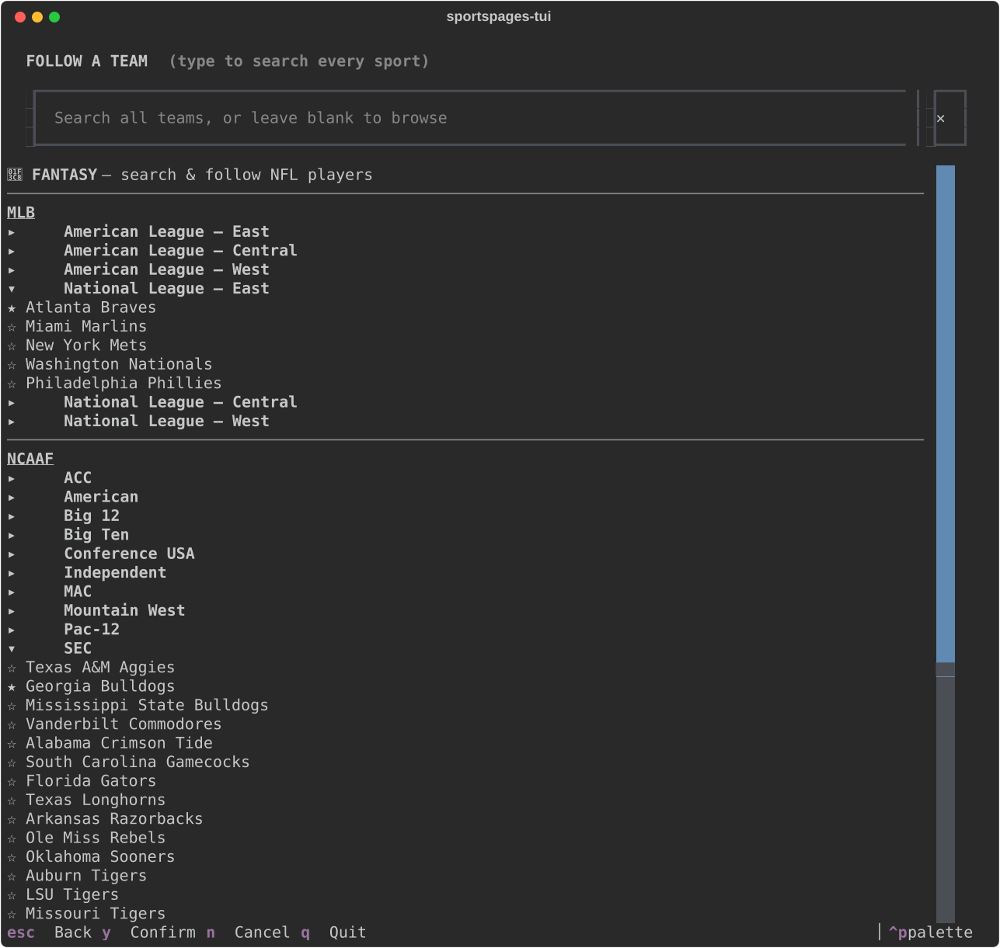
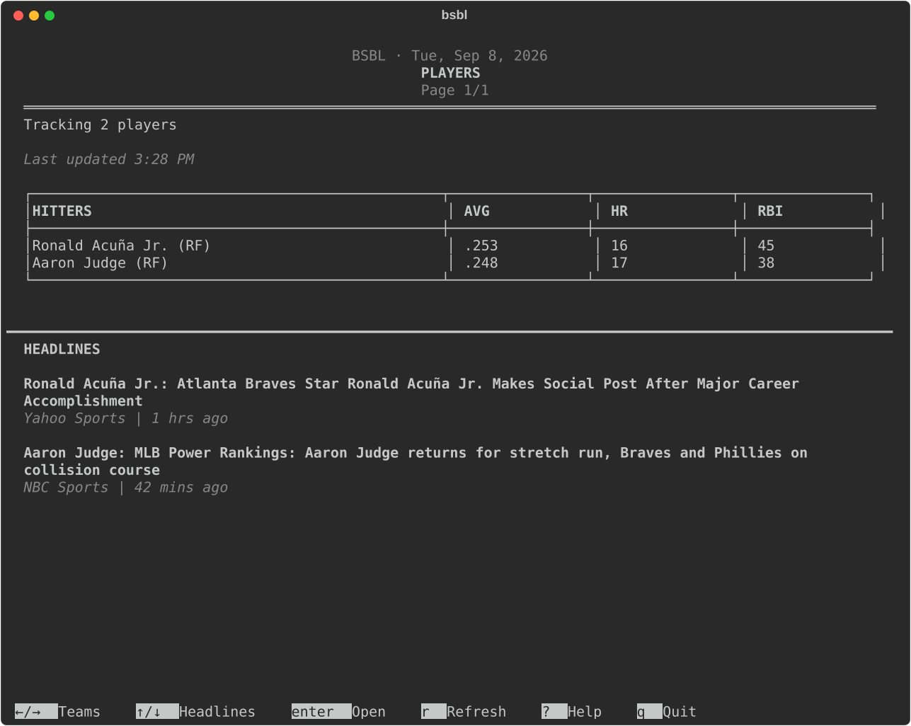

# bsbl

<p align="center">
  
</p>

A newspaper-styled terminal UI for following MLB games and players, in
the tradition of tools like Newsboat: launch it, swipe left/right
between your teams, scroll up/down through the news, single-letter
hotkeys for everything else.

Built with [Textual](https://textual.textualize.io/), pulling live
scores from the free, keyless MLB Stats API (`statsapi.mlb.com`) and
headlines from Google News + Bing News RSS — no API key required, no
account, nothing to sign up for, and no undocumented internal API to
lean on.

<p align="center">
  
</p>
<p align="center">
  
</p>
<p align="center">
  
</p>
<p align="center">
  
</p>

## Status

MLB only. Masthead, live score, inning-by-inning box score, batting
order, and season player stats for however many teams you follow, plus
an aggregate page for individually followed players (season stats and
one headline each) — for tracking a specific player without pulling in
their whole team. While a game is live: current batter/pitcher,
ball-strike count, out count, and a bases diamond showing who's on
base.

## Install

**Homebrew** (macOS/Linux):

```bash
brew tap tylersuits1/bsbl https://github.com/tylersuits1/bsbl
brew install bsbl
```

(the formula lives in this repo, at [`Formula/bsbl.rb`](Formula/bsbl.rb) — no separate
`homebrew-bsbl` tap repo, so it needs that explicit tap URL rather than
the `brew install tylersuits1/bsbl/bsbl` shorthand, which assumes a
`homebrew-<name>` repo by convention)

**From source:**

```bash
python3 -m venv .venv
source .venv/bin/activate
pip install -e .
```

## Run

```bash
bsbl
# or: python -m bsbl
```

On first launch (no followed teams yet) it opens the team picker
directly. Your followed teams and players persist between runs in
`~/.config/bsbl/favorites.json`.

## Keys

| Key     | Action                            |
|---------|------------------------------------|
| ← / →   | Switch between followed teams      |
| ↑ / ↓   | Scroll headlines / page content    |
| `s`     | Toggle player stats                |
| `b`     | Toggle batting order               |
| `h`     | Toggle headlines                   |
| `r`     | Refresh now                        |
| `a`     | Follow / unfollow teams or players |
| `p`     | Pause / resume live auto-refresh   |
| `z`     | Scoring plays recap for this game  |
| `?`     | Help screen                        |
| `q`     | Quit                                |

Live scores auto-refresh every 15 seconds while a game is in progress,
and stop once the game goes final.

In the team picker (`a`): browse by league → division, or type to
search by team name/city. A pinned "PLAYERS" entry at the top opens a
separate screen to search and follow individual players by name — back
button, `escape`, or `shift+enter` returns to the team list. Division
groups start collapsed; `enter` expands one, or follows/unfollows a
team. `shift+enter` saves and closes immediately, from anywhere on the
screen — including mid-search, without needing to clear the search box
first. `escape` instead asks you to confirm (`n` cancels) before
exiting, listing everything you're following.

## Project layout

```
bsbl/
├── app.py                  # Textual App — main screen, key bindings, live refresh
├── rendering.py            # pure functions building the Rich renderables (masthead, box score, etc.)
├── mlb_api.py              # MLB Stats API client (async) — scores, box score, roster/player stats, player search
├── mlb_teams.py            # static MLB team/league/division table
├── models.py               # dataclasses (BoxScore, TeamSide, PlayerStat, PlayerSearchResult, Headline, ...)
├── news_sources.py         # Google News + Bing News RSS, merged into one headline list
├── config.py               # favorites + followed-player persistence (~/.config/bsbl/)
├── date_format.py          # short (body) vs full (masthead) date formatting
├── screens/
│   ├── team_picker.py      # MLB team picker: browse by division, or search; pinned entry into Players
│   ├── player_picker.py    # individual player search/follow screen
│   ├── scoring_plays.py    # scoring-plays recap for the current game
│   └── help.py             # keybinding reference overlay
└── app.tcss                 # styling
```

## Testing

**Unit tests** (`tests/unit/`) — offline, deterministic, no network or
real `~/.config/bsbl`: rendering, MLB Stats API response parsing, RSS
parsing, config persistence, date formatting, team lookups. Fixture
JSON in `test_mlb_api.py` mirrors real recorded API response shapes,
not an invented schema.

```bash
pip install -e ".[dev]"
pytest
```

These run in CI (`.github/workflows/tests.yml`) on every push/PR,
across Linux, three macOS versions (Ventura/Sonoma/Sequoia, to catch
anything an OS update breaks), and Windows — even though Windows isn't
a supported install target (Homebrew is macOS/Linux only), it's kept
in the matrix since a non-portable `strftime` flag once broke the
masthead date there.

**Manual live smoke tests** (`tests/`) — a no live game finishing
during development makes the "up next" / completed-game path hard to
eyeball manually, so these drive the real app (via Textual's test
pilot) against *live* MLB data and assert on state — team switching,
panel toggles, live data actually arriving. Not run in CI (network-
and live-game-dependent); run by hand:

```bash
python tests/smoke_test.py
python tests/player_smoke_test.py   # search/follow/render for a real player
```

`tests/screenshot_test.py` dumps an SVG render of the live app to
`tests/screenshot.svg` for visual spot-checks (gitignored, not meant to
be committed).

## A note on data sources

Scores, box scores, and player stats come from the MLB Stats API
(`statsapi.mlb.com`) — public and keyless, though still not a formally
documented third-party API with published terms. Headlines come from
Google News and Bing News' public RSS search feeds, which explicitly
allow personal, non-commercial use in a feed reader. Deliberately no
dependency on ESPN's `site.api.espn.com` — those are undocumented
endpoints the espn.com website calls internally, and Disney's (ESPN's
parent) Terms of Use explicitly prohibit automated/robotic access to
them. Not legal advice on the MLB Stats API either — evaluate that risk
yourself if it matters for your use case.

## License

[MIT](LICENSE)
